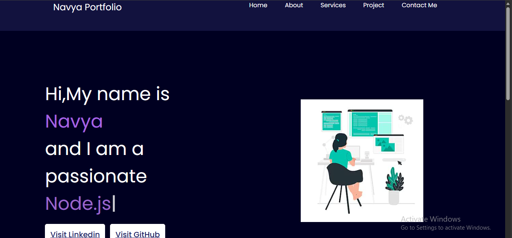

# Personal Portfolio Website

A modern and responsive personal portfolio website showcasing skills, projects, achievements, and contact information.

---

## 📌 Overview

This portfolio website is designed to present personal projects, technical skills, and professional information in a clean and interactive way.  
The project focuses on responsive design, modern UI, and smooth user experience.

---

## 🚀 Features

- Responsive portfolio design
- Modern and clean UI
- Projects showcase section
- Skills and achievements section
- Contact information section
- Smooth navigation experience

---

## 🛠 Tech Stack

- HTML
- CSS
- JavaScript
- React

---

## 📸 Project Screenshot



---

## ⚙️ Installation

```bash
git clone https://github.com/your-username/personal-portfolio.git

cd personal-portfolio

npm install

npm start
```

---

## 📂 Project Structure

```bash
src/
components/
assets/
pages/
```

---

## 🔮 Future Improvements

- Dark mode support
- Animation enhancements
- Blog section
- Resume download feature
- Backend integration

---

## 🎯 Objectives

- Showcase technical skills and projects
- Build a professional online presence
- Create an interactive user experience
- Improve frontend development skills

---

## 👩‍💻 Author

Made with ❤️ by Navya Sharma

---

## 📄 License

This project is created for personal and educational purposes.
